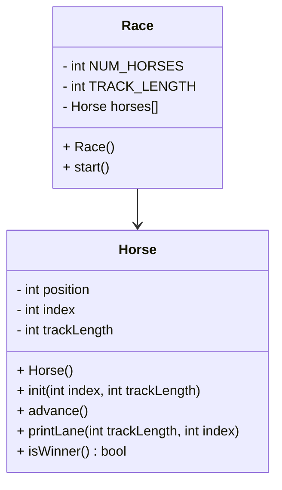

# CS121_OOP_horse

This function should make create a random, procedurally run horse race game. 
It will compile the classes Race and Horse, as well as their header files and a main function into a Makefile.


# UML



## Race::Race() 
```
const int TRACK_LENGTH
const static int NUM_HORSES

Create an array of horses length NUM_HORSES
Initialize all the horses
for each horse
	initialize that horse with its index and the track length
```

### Race::start()
```
seed random
bool keepGoing
while keepGoing:
	go through each horse:
		advance that horse
		print horse's lane
		if that horse won:
			set keepGoing to false
```

## Horse::Horse()
```
position = 0
index = 0
trackLength = 15
```

## void Horse::init (int index, int tracklength)
```
Horse::index = index
Horse::trackLength = trackLength
Horse::position = 0
```

## void Horse::advance()
```
int forward = random number either 0 or 1
add forward to Horse::position
```

## void Horse::printLane()
```
//for 0 to horse's position
//	print "."
//print horse's index
//for horse's position to TRACK_LENGTH
//	print "."
//print line break
for sentry 0 to trackLength
	if Horse::position == sentry
		print Horse::index
	else
		print "."
print line break
```

## bool Horse::isWinner()
```
bool winning = false
if position >= trackLength:
	winning = true
	print message declaring a horse has won
return winning
```

# Main file
```
import iostream
import race header
import horse header

begin main
    construct the race with Race()
    start the race
end main
```
